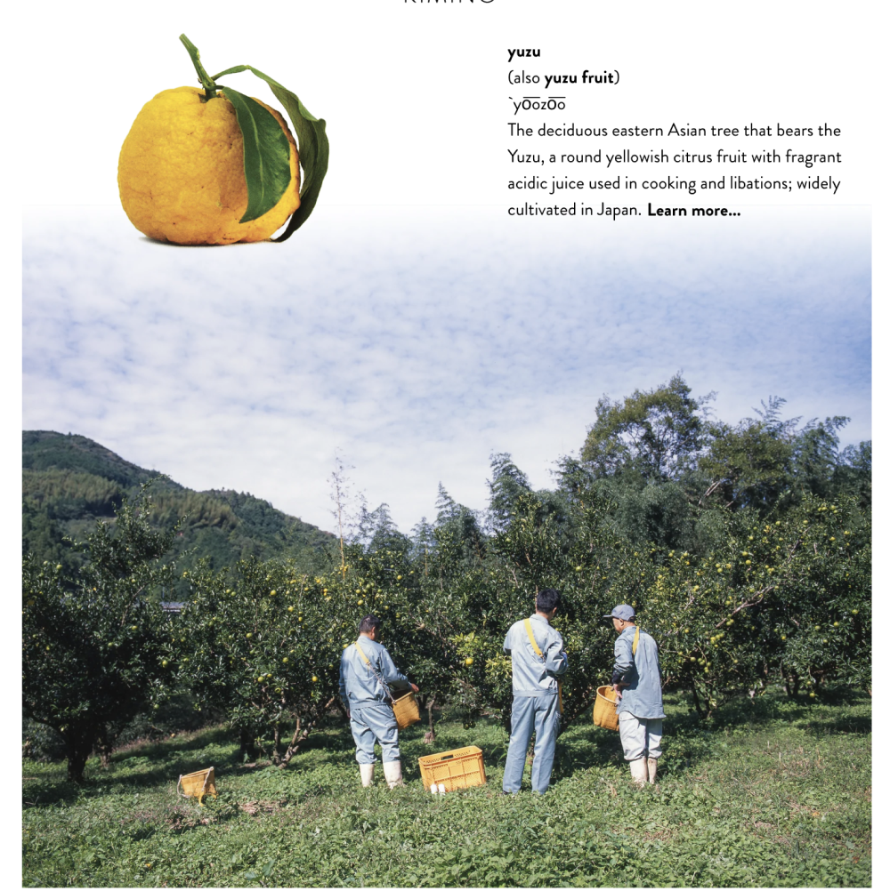

# ABSTRACT

We overhauled Kimino's digital profile by redesigning their website and introducing Klaviyo email marketing to their customer base. We used data collected with tools ranging from Google Analytics to General Instance to craft a unique user experience centered around maximizing e-commerce revenues while remaining faithful to Kimino's elegant identity and emphasis of traiditional Japanese farming methods. 
# ART DIRECTION 

    <figure>
        
        <figcaption align="center">
            Fukujiro with his son and grandson drinking yuzu sparklng water in Shikoku. 
        </figcaption>
    </figure>
    

        
    

<figure>
    
    <figcaption align="center">
        Fukijro and his son and grandson sipping Kimino in a Yuzu orchard. 
    </figcaption>
</figure>

# WEB DESIGN, E-COMM OPTIMIZATION

Sam served as lead designer and developer of Kimino’s new US and Japanese site designs with George's creative direction. We used the new Shikoku assets in the new iterations of the website, included marked improvements to accessibility, purchase interface and flows and a cleaner and simplified overall UI.
