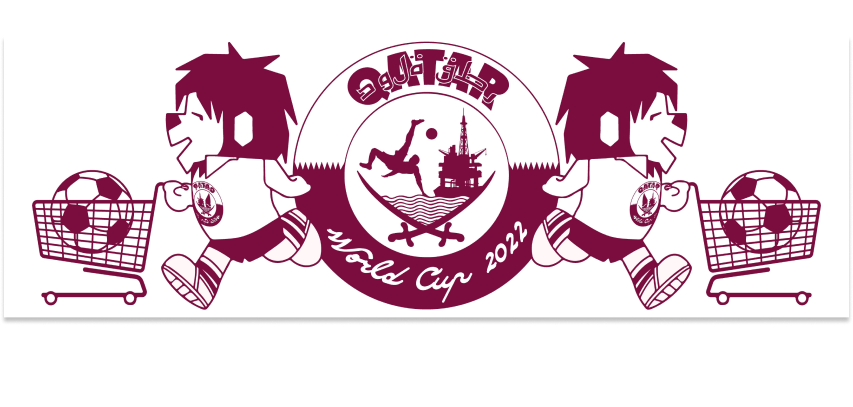

## Onside

Onside produces apparel and objects associated with the beautiful game. Launched in late 2022, its first collection sold under the Doha Superstore centered around the players, events and iconography of the “most normal world cup so far.” A new collection centered around the champions league is slated to drop before the end of this season. 

<figure>
    
    <figcaption align="center">

# ART DIRECTION; PROMOTION 

<figure>
    
    <figcaption align="center">
       Athena, Hua & Ian wearing Willie the Lion, USA v. England & Rising Stars Tees. 
    </figcaption>
</figure>

<figure>
    
    <figcaption align="center">
       Adam Platt for Onside.  
    </figcaption>
</figure>      

# WEB DESIGN/SHOPIFY INTEGRATION

<figure>
    
   
PG co. designed a custom Shopify theme for Onside and integrated the site’s POS with their fulfillment operation. 
